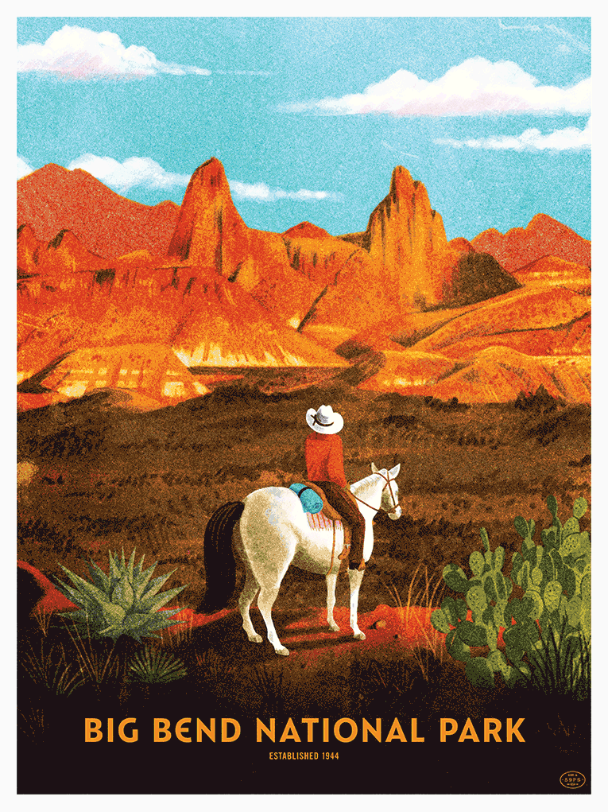
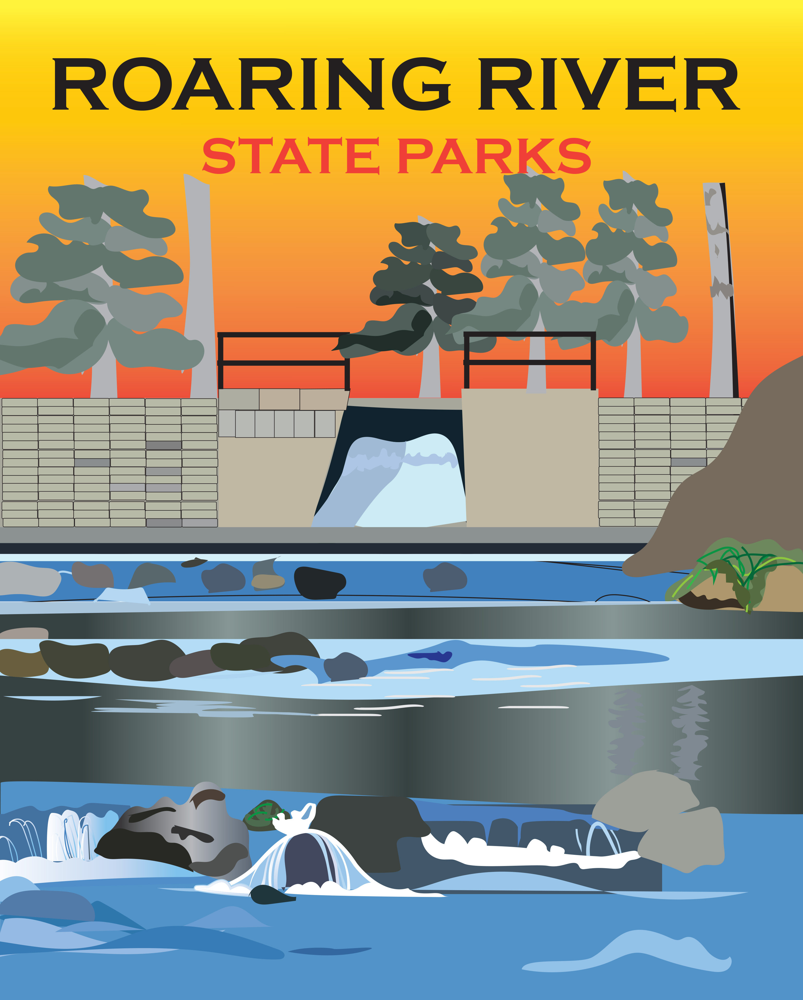

# Capturing A Familiar Scene

*Photo of Brad Woodard’s Poster Design of Big Bend Nationl Park displayed on Adobe Create Magazine.*

As the inspiration for my blog, Adobe Create Magazine has always been there feeding me fresh ideas. I highly recommend checking out their website. I actually arrived at my topic today through inspiration i received from one of their stories. The article that got me inspired, talked about a poster series created by Brad Woodard. The series included 59 poster designs, and all 59 posters represented a different national park. It really got me thinking. To fully capture the complete essence of an entire park in just once image. That's talent. To be able to create something beautiful that people will look at, immediately recognize and reflect on their personal experiences. That led me to think about some of the parks I’ve become the most familiar with in my life time. In fact, I drive by a state park every single day. How interesting would it be to take a place I’m so familiar with and think about it in a nonobjective way. To truly capture an accurate representation of the park and what it means to everyone who enjoys it. That was an idea I wanted to run with. I wanted to create my own poster of a park that I had known and loved my whole life. The problem was that I had so many different ideas on how to display the park popping into my head, that I couldn't just pick one. So I decided to begin a new series. Similar to Woodard, I will have multiple poster designs reflecting the main idea of a park, but unlike Woodard's series, mine will be focusing in on one park rather than 59. Below I have displayed a sneak peak at my first poster design for this series. Make sure to stay tuned in to see my progress on this piece, as well as updates on future pieces to this series!

 
 

*A sneak peak at the beginnings of one of my pieces in the Roaring River State Park series*

 
 ## Sources
 
  https://create.adobe.com/2016/8/25/_59_parks_59_posters.html
